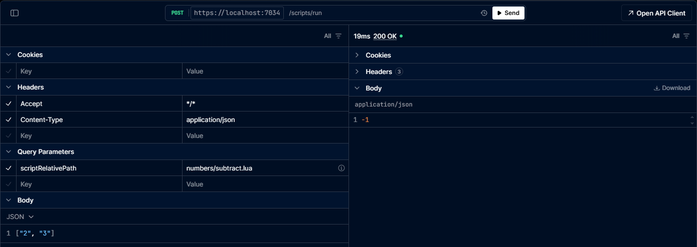

# Interpreter
A .NET 9 web api that attempts to defer as much business logic as possible to lua scripts.

The purpose is to mitigate the need to rebuild or redeploy the .NET application in order to see changes in the output or logic of the appplication, and allow for higher speed of development.

## Installation
- Download the repo
- Run `dotnet restore`
- Run `dotnet build`
- Run `dotnet run --project .\src\Interpreter.API\Interpreter.API.csproj`

## Usage
- Use the existing `/scripts/run` or `/scripts/run-async` endpoints
    - The path to the script is in the form of the `scriptRelativePath` query parameter on the endpoint
    - Arguments to the scripts are provided in the form of a collection of string values in the POST body
- Use a dependency injected [`IScriptManager`](src/Interpreter.Logic/Managers/IScriptManager.cs) to gain access to the `Run(string, IEnumerable<string>?)` and `RunAsync(string, IEnumerable<string>?)` methods
    - The path to the script is the `string` parameter for both methods
    - Arguments to the scripts are provided as the `IEnumerable<string>?` parameter for both methods

## Development
- Ensure each lua script returns exactly one `function`, which will be invoked either via API or an injected [`IScriptManager`](src/Interpreter.Logic/Managers/IScriptManager.cs)
- The [`scripts`](scripts/) directory location can be customized from the backend's application settings
    - Fill out [`the development app settings`](src/Interpreter.API/appsettings.Development.json) with the new path, either absolute or relative to [`the API root folder`](src/Interpreter.API/)
- Change any lua script in the [`scripts`](scripts/) directory to change application logic in realtime
- Create any new directories and lua scripts in the [`scripts`](scripts/) directory to extend application logic
    - Use the existing `/scripts/run` or `/scripts/run-async` endpoints or [`IScriptManager`](src/Interpreter.Logic/Managers/IScriptManager.cs`) `Run()`/`RunAsync()` methods to run the new script

### Example Development Flow
Create a new lua script: `scripts\numbers\subtract.lua`
```lua
local function subtract(a, b)
    return a - b
end

return subtract
```

Use the Scalar UI to call this new script via the API and get the results:



Or create a new controller to call this new script via a dependency injected [`IScriptManager`](src/Interpreter.Logic/Managers/IScriptManager.cs`), then use the Scalar UI to invoke the new endpoint and get the results:
```csharp
using System.Net.Mime;
using Microsoft.AspNetCore.Mvc;
using Interpreter.Logic.Managers;

namespace Interpreter.API.Controllers;

[ApiController]
[Route("[controller]")]
public class SubtractController(IScriptManager scriptManager) : ControllerBase
{
    [HttpGet]
    [Produces(MediaTypeNames.Application.Json)]
    [ProducesResponseType(StatusCodes.Status200OK)]
    [ProducesResponseType(StatusCodes.Status500InternalServerError)]
    [EndpointDescription("Call the numbers/subtract.lua script and show the results.")]
    public int? Subtract(int a, int b) => scriptManager.Run("numbers/subtract.lua", [$"{a}", $"{b}"]);
}
```

## Architecture
### C#
Inside the [`src`](src/) directory, there are three projects in the .NET 9 backend:
- [`Interpreter.Domain`](src/Interpreter.Domain/): Data models with no dependencies
- [`Interpreter.Logic`](src/Interpreter.Logic/): Application logic, mostly to load and run lua scripts
- [`Interpreter.API`](src/Interpreter.API/): Exposes the API and houses the application settings and bootstrap logic

### Lua
Inside the [`scripts`](scripts/) directory, there are many directories and lua files which are invoked by the backend.

The repo comes with a pre-packaged set of lua scripts that can be used for testing, and built upon or further customized, or removed completely:
- [`config.lua`](scripts/config.lua): An example of an endpoint which returns one or many [application configurations](scripts/config/app_settings.lua) meant to be hit by the API
- [`endpoints.lua`](scripts/endpoints.lua): An example of an endpoint which returns one or many [endpoints](scripts/endpoints/all_endpoints.lua) meant to be hit by the API
- [`cache`](scripts/cache/): An example of [distributed](scripts/cache/distributed-cache.lua), [in-memory](scripts/cache/memory-cache.lua), [hybrid](scripts/cache/hybrid_cache.lua) caching, with a means to [set](scripts/cache/set_cache.lua) and [get](scripts/cache/get_cache.lua) cached values
    - [`config/app_settings.lua`](scripts/config/app_settings.lua) has a `cache` property which can be changed in real-time to change the cache strategy
- [`base`](scripts/base/): An example of some base lua tables and metatables which allow json responses from lua to the backend
- [`utils`](scripts/utils/): A collection of utility lua scripts used throughout the lua scripts

## Run Scripts In Separate Programs
It is also possible to call the API from an external system, as outlined in the following examples.

All of these examples assume the Interpreter API is running locally at `https://localhost:7034`.

#### PowerShell
```powershell
# Runs a script via the Interpreter API
function Run-Script {
    param(
        [Parameter(Mandatory = $true)] [string] $ScriptRelativePath,
        [Parameter()] [string] $Body
    )

    $BaseApiUrl = "https://localhost:7034"
    $ContentType = "application/json"
    $EncodedPath = [System.Uri]::EscapeDataString($ScriptRelativePath)
    $FullUri = "$BaseApiUrl/scripts/run?scriptRelativePath=$EncodedPath"
    Invoke-WebRequest -Uri $FullUri -Method POST -Headers @{ "Content-Type" = $ContentType } -Body $Body -ContentType $ContentType
}

# Example usage:
Run-Script -ScriptRelativePath "numbers/add.lua" -Body '["2", "3"]'
```

#### C#
```csharp
using System.Net.Http.Headers;
using System.Uri;

namespace SomeProject;

public static class ScriptRunner
{
    private static readonly HttpClient _httpClient = new();

    /// <summary>
    /// Runs a script via the Interpreter API
    /// </summary>
    public static async Task RunScript(string relativeScriptPath, IEnumerable<string> arguments? = null)
    {
        var escapedRelativeScriptPath = EscapeDataString(relativeScriptPath);
        var content = arguments == null ? "" : $"[{string.Join(',', arguments)}]";
        var request = new HttpRequestMessage
        {
            Method = HttpMethod.Post,
            RequestUri = new Uri($"https://localhost:7034/scripts/run?relativeScriptPath={escapedRelativeScriptPath}"),
            Content = new StringContent(content)
            {
                Headers = { ContentType = new MediaTypeHeaderValue("application/json") }
            }
        };

        return await _httpClient.SendAsync(request);
    }
}

// Example usage:
var response = await ScriptRunner.RunScript("numbers/add.lua", ["2", "3"]);
```

#### JavaScript
```javascript
// Runs a script via the Interpreter API
const runScript = async (relativeScriptPath, args) => {
    const runScriptUrl = new URL('/scripts/run', 'https://localhost:7034');
    runScriptUrl.search = new URLSearchParams({ 'scriptRelativePath': relativeScriptPath });
    return await fetch(runScriptUrl, {
        method: 'POST',
        headers: { 'Content-Type': 'application/json' },
        body: JSON.stringify({args})
    });
};

// Example usage:
runScript('numbers/add.lua', ["2", "3"])
    .then(response => response.json())
    .then(jsonResponse => console.info(`Response from script: ${jsonResponse}`));
```
